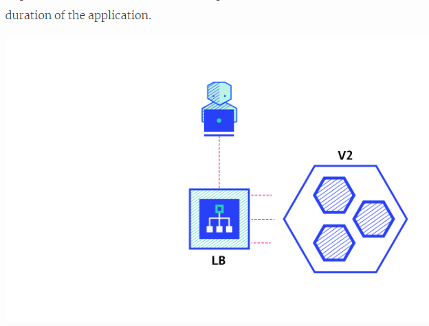

# Six Strategies for Application Deployment

# ***[Source of Knowledge](https://thenewstack.io/deployment-strategies/)***

## Recreate

### Shuting down A then deploying version B
**Before**
 
  
 
**After:**
 

### Pros
* Easy to setup
* Application state entirely renewed

### Cons
* High inpact on the user, expect downtime that depends on both shutdown and boot duration of the application

 

## Ramped

### THe ramped deployment strategy cnsosts of slowly rolling out a version of an application by replacing instances one after the other untill all the instances are rolled out.

 

### Quick note
The key difference between stateful and stateless applications is that stateless applications don't “store” data whereas stateful applications require backing storage.

### Pros
* Easy to set up
* version is slowly released across instances
* Convient for stateful applications that can handle rebalancing of the data

### cons
* Rollout/rollback can take time.

* Supporting multiple APIs is hard.

* No control over traffic.

## Canary

### A canary deployment consists of gradually shifting production traffic from version A to version B.

 

### pros:
* Version released for subset of users
*  COnvenient for error rate and perfomance monitoring
*  Fast rollback

### Con
* Slow rollout

 

## Blue/Green 

### The blue/green deployment strategy differs from ramped deployment, version B (green) is deployed alongside version A (blue) with exactly the same amount of instances.

 

### pros
* Instant rollout/rollback
* Avoid versioning issue, the entire application state is changed in one go
  
### Cons

* Expensive as it requires fouble the resources
* Proper test of the entire platform should be done before releasing to production
* Handling stateful application can be hard

## A/B testing 

### A/B testing deploments consnst of routing subset of users to a new functionality under specific conditions,

 

### Pros: 

* Several versions run in parallel
* Full control over the traffic distribution

### Cons

* Requires intelligent load balancer
* Hard to troubleshoot errors for a given session, distributed tracing becomes mandatory

 

### Shadow 
 
### A shadow deployment consists of releasing version B alongside version A, fork version A’s incoming requests and send them to version B as well without impacting production traffic. 

### Pros:

* Performance testing of the application with production traffic.
* No impact on the user.
* No rollout until the stability and performance of the application meet the requirements.

### Cons

* Expensive as it requires double the resources.
* Not a true user test and can be misleading.
* Complex to setup.
* Requires mocking service for certain cases.