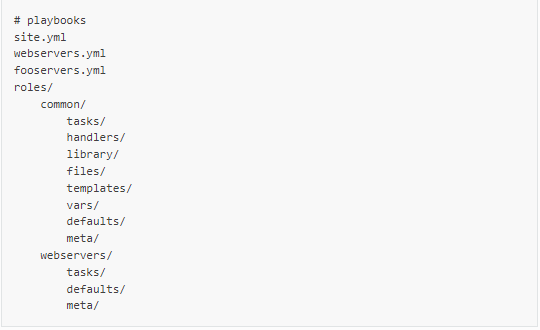
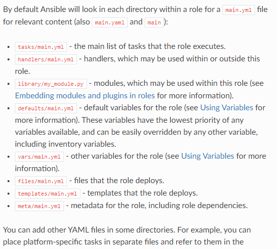
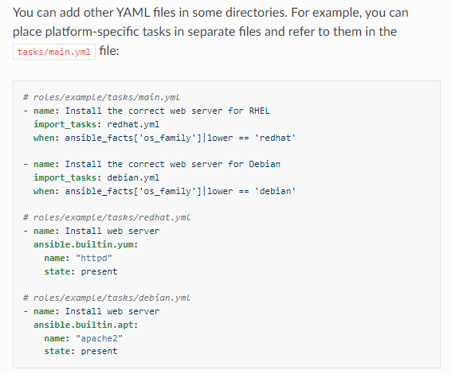
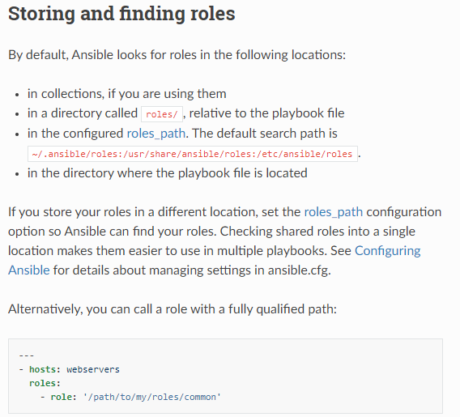

# Roles

### Roles let you automatically load related vars, files, tasks, handlers, and other Ansible artifacts based on a known file structure. After you group your content in roles, you can easly reuse them and share them with other users.

## Role directory structure

 

 

 

## Using roles at the play level

### the classic (original) way to use roles in with the **roles** option for a given play:

~~~yml
---
- hosts: webservers
  roles: 
    - common
    - webservers
~~~