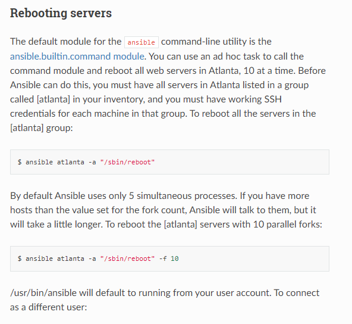
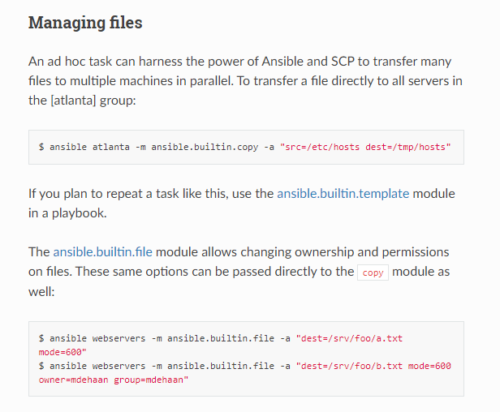

# Setup deep dive

## Introduction to ad hoc commands
 An ansible ad hoc command uses /usr/bin/ansible command-line tool to automate a single task on or more managed nodes. ad hoc commands are quick and easy, but they are not reusable.

 

## But Why use ad hoc commands?
ad hoc commands are great for tasks you repeat raely

~~~bash
ansible [pattern] -m [module] -a "[module options]"
~~~

 

## Use cases for ad hoc tasks
ad hoc tasks can be used to reboot servers, copy files, manage packeges and users, and much more.

 

# [Source of Knowledge](https://learn.acloud.guru/course/443e09cc-7465-438d-9d35-1bf9c1802f83/overview)

