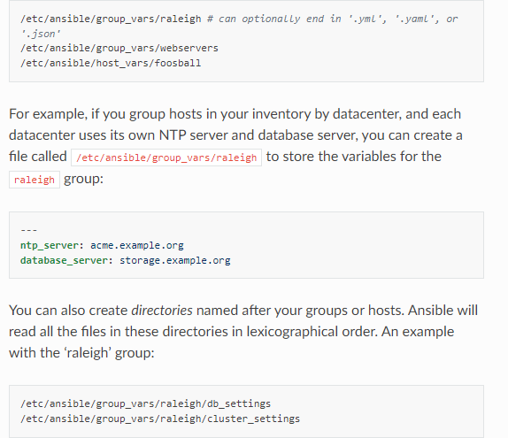

# This is all about invetory file

### Ansible can work with multiple nodes , using list or group of lists knows as inventory.  
### The default location for inventory is a file called /etc/ansible/hosts. You can specify different invetory file at the command line using  **-i path option**

 

## Invetory basics: formats,hosts, and groups

### A basic INI format

~~~INI
mail.example.com

[webservers]
foo.example.com
bar.example.com

[dbservers]
one.example.com
two.example.com
three.example.com
~~~

 

## Hots in multiple groups

### You can put each host in more than one group

~~~yaml
all:
  hosts:
    mail.example.com:
  children:
    webservers:
      hosts:
        foo.example.com:
        bar.example.com:
    dbservers:
      hosts:
        one.example.com:
        two.example.com:
        three.example.com:
    east:
      hosts:
        foo.example.com:
        one.example.com:
        two.example.com:
    west:
      hosts:
        bar.example.com:
        three.example.com:
    prod:
      hosts:
        foo.example.com:
        one.example.com:
        two.example.com:
    test:
      hosts:
        bar.example.com:
        three.example.com:
~~~

## Adding ranges of hosts

~~~INI
[websrvers]
app[02:50].example.com
~~~

 

## Assigning a variable to one machine: host variables

~~~INI
[atlanta]
host1 http_port=80 maxRequestPerChild=808
host1 http_port=666 maxRequestPerChild=909
~~~

 

## Assigning a variable to many machines: group variables

~~~INI
[atlanta]
host1
host2

[atlanta:vars]
ntp_server=ntp.atlanta.example.com
proxy=proxy.atlanta.example.com
~~~

 

## Organizing host and group variables

### Host and group variables files must use YAML syntax.

 

### Ansible loads host and group variables files by searching paths relative to the inventory file or the playbook file. Ansible doing that by default

