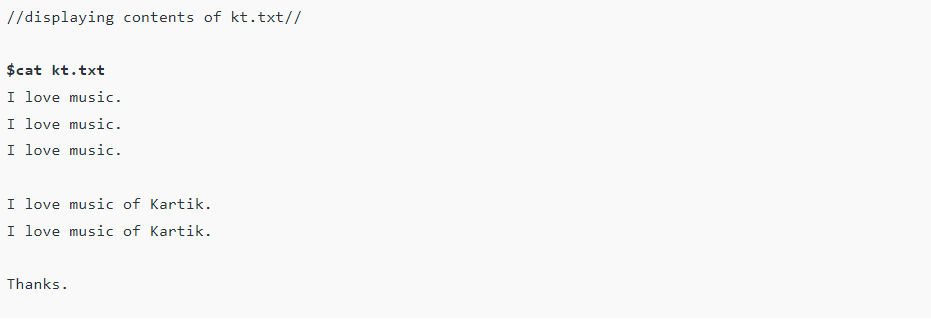

# Linux Command line Commands

> The linux command line is a very powerful tool for programmers. Much can be achived with it

 

##  Cat command

reads content of a file
> cat filename

 

## Changing Directories

> cd ${Directory name you wanna go}

## Copying file

> cp option file1 file2

The above command will create a dublicate of the file file1

 

## ln command ????

## locate command
> locate whois

The command above will search for all the files whose names contain the string "whois"

 

## logout command

> logout

This command just logs out current user 

 

## ls command
> ls

This command will give you list of items directory contains

 

## mv command
> mv -i myfile file

The command will rename file myfile to file, meaning that it will have been moved. 
It moves it renames wooow :)
This is a strong message :D 

 

## grep command
> grep 'powerful' myfile

The command outputs the line of the file with the search word and makes the search word red in color.

 

## tail command
> tail myfile -n 2

command outputs last lines of text
and -n option specifies how many lines we want to print

 

## wc command
wc stants for wall count. This command is used to count the lines contained in a certain file

> wc -l <myfile
> 

 

##  cut command

 

## tr command
command for translating or deleting

 

## uniq
Uniq command that reports or filters out the repeated lines in a file

