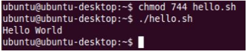
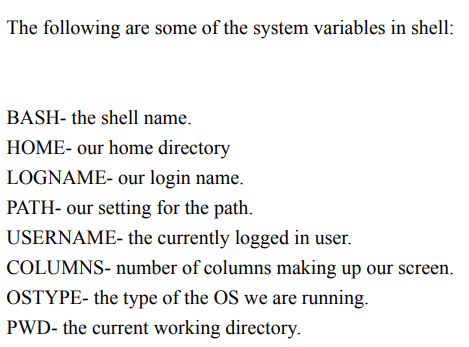
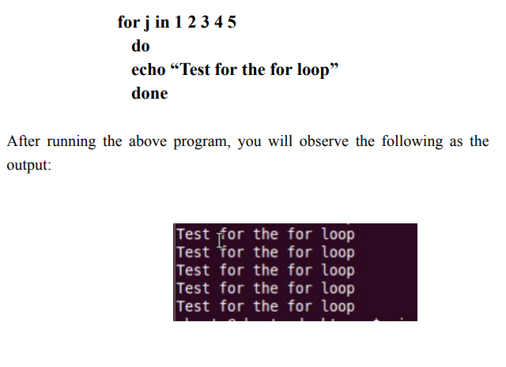

# In linux, it is very easy to create shell scripts.
> #!/bin/bash
> echo "Hello World"

lets make shell script executable
> chmod 744 hello.sh

## Variables in Shell

## for loop

## while loop
while [ conditoon ]  
do  
commands  
done

# Case statement

~~~bash
case $arg in  
    "lorry") echo "For $arg" 10 per k/m;;  
    "merc") echo "For $arg" 10 per k/m;;  
    "corolla") echo "For $arg" 10 per k/m;;  
    "motorbyke") echo "For $arg" 10 per k/m;;  
    "*") echo "For $arg" 10 per k/m;;  
esac
~~~

## If else statements

~~~bash
if [ $arg -eq 5 ]
then
    echo "$arg equal to 5"
elif [ $arg -eq 4 ]
then
    echo "$arg equal to 4 "
else
    echo "I dont know whats happening here"
fi
~~~
