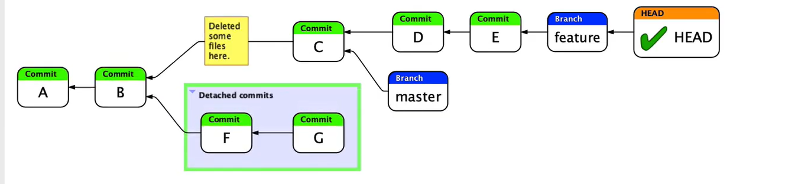
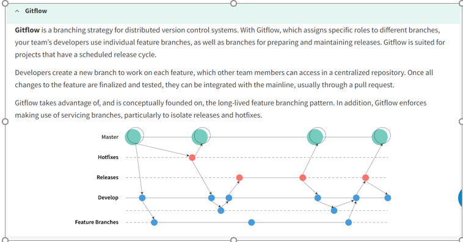

# This is git notes

## Version Control concept
Version control, also known as source control, is the practice of tracking and managing changes to software code. Version control systems are software tools that help software teams manage changes to source code over time.

# Git basic commands

### 1. adds a change in the Working directory to the staging area 
~~~
git add [option]
~~~

### 2. commit changes "ready to push"
~~~
git commit -m "Some useful message everybody wants to read :D"
~~~

### 3. push remote repo
~~~
git push 
~~~

### 4. Clone remote repo
~~~
git clone
~~~

### 5. Pull command helps you to  immediately update the local repository to match that content
~~~
git pull
~~~

# Ignore .gitignore
.gitignore helps you to ignore files.
For example if you change something and you dont want to push that you can write that file name into .gitignore file and git will ignores that 

# GIT HEAD  in One pic :)

# Undoing changes

The git reset command is a complex and versatile tool for undoing changes. It has three primary forms of invocation. These forms correspond to command line arguments --soft, --mixed, --hard. The three arguments each correspond to Git's three internal state management mechanism's, The Commit Tree (HEAD), The Staging Index, and The Working Directory.

## 1. Moves change from commit to staging area
~~~
git reset --soft
~~~
## 2. Moves change from commit to file system
~~~
git reset --mixed
~~~
## 3. Deletes commit
~~~
git reset --hard
~~~

# Branching and merge 
~~~
git merge <branch-name-you-want-to-merge>
#remember you are in a main branch
~~~

# Branching strategies
## Centralized strategy Evrybody agreed to work in the master branch

## Feature-branch workflow. Create feature code it and push it 

## Gitflow

# Knowledge Source 
## Any youtube video :D plus https://learngitbranching.js.org/
