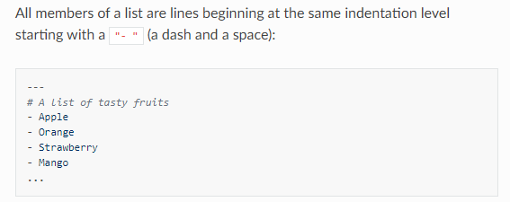
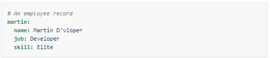
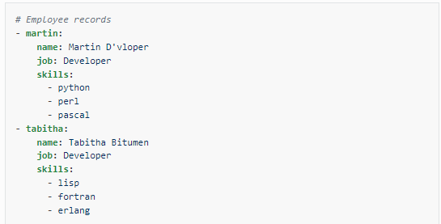
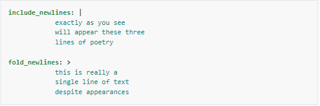

# YAML Syntax

## YAML Basics

### For Ansible, nearly every YAML file starts with a list. Each item in the list is a list of key/value pairs, commonly called a “hash” or a “dictionary”. So, we need to know how to write lists and dictionaries in YAML.

### a DICTIONARY IS REPRESENTED IN A simple ***key: value*** form

 

### More complicated data structures are possible, such as lists of dictionaries, dictionaris whose values are lists or a mix of both

### Values can span multiple lines using | >.

 

# Source of knowledge
***[YAML](https://docs.ansible.com/ansible/latest/reference_appendices/YAMLSyntax.html)***
